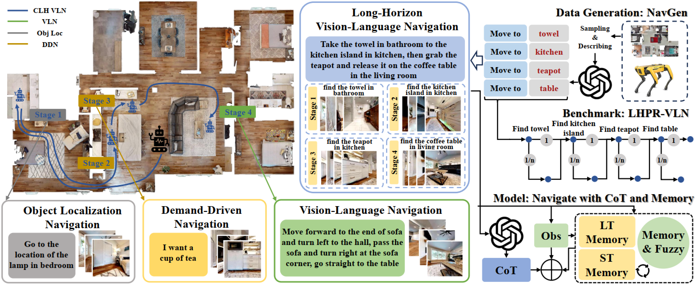

<div align="center" style="font-family: charter;">

<h1>Towards Long-Horizon Vision-Language Navigation:</br> Platform, Benchmark and Method (CVPR-25)</h1>


<br />

<a href="https://arxiv.org/abs/2412.09082" target="_blank">
    
</a>
<a href="https://hcplab-sysu.github.io/LH-VLN/" target="_blank">
    
</a>
<a href="https://github.com/HCPLab-SYSU/LH-VLN" target="_blank" style="display: inline-block; margin-right: 10px;">
    
</a>

<div>
    <a href="songxsh@mail2.sysu.edu.cn" target="_blank">Xinshuai Song</a><sup>1*</sup>,</span>
    <a href="chenwx228@mail2.sysu.edu.cn" target="_blank">Weixing Chen</a><sup>1*</sup>, </span>
    <a href="liuy856@mail.sysu.edu.cn" target="_blank">Yang Liu</a><sup>1,3</sup>,</span>
    <a href="chenwk891@gmail.com" target="_blank">Weikai Chen</a><sup> </sup>,</span>
    <a href="liguanbin@mail.sysu.edu.cn" target="_blank">Guanbin Li</a><sup>1,2,3</sup>,</span>
    <a href="linliang@ieee.org" target="_blank">Liang Lin</a><sup>1,2,3</sup>,</span>
</div>

<div>
    <sup>1</sup>Sun Yat-sen University&emsp;
    <sup>2</sup>Peng Cheng Laboratory&emsp;
    <sup>3</sup>Guangdong Key Laboratory of Big Data Analysis and Processing&emsp;
</div>

<p align="justify"><i>Existing Vision-Language Navigation (VLN) methods primarily focus on single-stage navigation, limiting their effectiveness in multi-stage and long-horizon tasks within complex and dynamic environments. To address these limitations, we propose a novel VLN task, named Long-Horizon Vision-Language Navigation (LH-VLN), which emphasizes long-term planning and decision consistency across consecutive subtasks. Furthermore, to support LH-VLN, we develop an automated data generation platform NavGen, which constructs datasets with complex task structures and improves data utility through a bidirectional, multi-granularity generation approach. To accurately evaluate complex tasks, we construct the Long-Horizon Planning and Reasoning in VLN (LHPR-VLN) benchmark consisting of 3,260 tasks with an average of 150 task steps, serving
as the first dataset specifically designed for the long-horizon vision-language navigation task. Furthermore, we propose Independent Success Rate (ISR), Conditional Success Rate (CSR), and CSR weight by Ground Truth (CGT) metrics, to provide fine-grained assessments of task completion. To improve model adaptability in complex tasks, we propose a novel Multi-Granularity Dynamic Memory (MGDM) module that integrates short-term memory blurring with long-term memory retrieval to enable flexible navigation in dynamic environments. Our platform, benchmark and method supply LH-VLN with a robust data generation pipeline, comprehensive model evaluation dataset, reasonable metrics, and a novel VLN model, establishing a foundational framework for advancing LH-VLN. </i></p>
</div>


## Citation

If you find our paper and code useful in your research, please consider giving us a star :star: and citing our work :pencil: :)
```
@inproceedings{song2024towards,
  title={Towards long-horizon vision-language navigation: Platform, benchmark and method},
  author={Song, Xinshuai and Chen, Weixing and Liu, Yang and Chen, Weikai and Li, Guanbin and Lin, Liang},
  booktitle={Proceedings of the IEEE/CVF Conference on Computer Vision and Pattern Recognition},
  year={2025}
}
```
