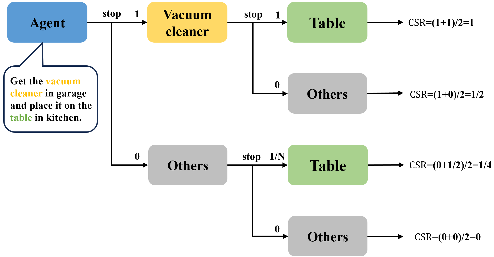

### Task Description

The LH-VLN task is a complex challenge composed of two to four sequential navigation subtasks. It requires the agent to comprehend complex instructions, identify the subtasks contained within, and complete them in the specified logical order to ultimately fulfill the overall command. These tasks emphasizes long-term planning and decision consistency across consecutive subtasks. The goal is to push agents beyond simple, short-term navigation by requiring them to deeply comprehend complex task instructions, maintain continuous navigation, and handle sequential sub-tasks seamlessly across a dynamic environment.

The metrics for the LH-VLN task are as follows:

- **SR**: Successful Rate

- **SPL**: Success weighted by Path Length

- **NE**: Navigation Error

- **ISR**: Independent Success Rate

$$
ISR = \sum_{j=0}^M \sum_{i=0}^N \frac{ s_{j,i}}{M \cdot N}
$$

where $M$ is the number of tasks, and $N$ is the number of sub-tasks in $\textrm{Task}_j$.

- **CSR**: Conditional Success Rate

$$
CSR = \sum_{j=0}^M \sum_{i=0}^N \frac{s_{j,i}(1+(N-1)s_{j,i-1})}{M \cdot N^2}
$$

where $s_{j,i}$ denotes the success of the $i$-th sub-task in $\textrm{Task}_j$.

- **CGT**: CSR weighted by Ground Truth

$$
CGT = \sum_{j=0}^M \sum_{i=0}^N \frac{P_i}{P} \cdot \frac{s_{j,i}(1+(N-1)s_{j,i-1})}{M \cdot N}
$$

- **TAR**: Target Approach Rate

$$
TAR=\sum_{j=0}^M \sum_{i=0}^N (1-\frac{max(NE_{j,i}-D_s,\ 0)}{max(NE_{j,i}, GT_{j,i})} )
$$

where $NE_{j,i}$ is NE of the $i$-th subtask of the $j$-th task, $D_s$ is the distance to be considered success, $GT_{j,i}$ is ground truth of the $i$-th subtask of the $j$-th task.

We will conduct a comprehensive evaluation based on these metrics.

We have not strictly defined the agent's inputs. For the agent, after receiving an instruction, it decides its next action by perceiving the environment, interacting with it, and receiving feedback. Apart from the initial **task instruction**, the agent can obtain information through environmental interaction as follows:

Environmental Feedback Received by the Agent:

- **RGB observations from three angles** (+60°,0°,−60°, resolution 366x366, with the option to add corresponding depth images).
- **Agent's current pose** (coordinate (x, y, z) + rotation matrix).

Actions the Agent Can Perform on the Environment:

- **"stop"**: Stop action, indicating the completion of the current task or subtask.
- **"turn_left"**: Turns left by 30 degrees.
- **"move_forward"**: Moves forward by 0.25 meters.
- **"turn_right"**: Turns right by 30 degrees.

At the beginning of each task, the agent performs a default `"stop"` action to acquire environmental feedback for its initial decision (this `"stop"` action does not affect the task). At each step, the agent decides its next action based on the task instruction, environmental feedback (both current and historical), and any other information that does not exceed the limits described above (such as the current action step count and information derived from the above data). This continues until the task is completed(the agent has output enough "stop" action) or the maximum action step limit is reached.

Taking the task "**Get the vacuum cleaner in the garage and place it on the table in the kitchen**" as an example, the following flowchart illustrates the agent's task execution and the evaluation process for the CSR metric:

where Others refers to objects that are not aligned with the current target.

### Code Description

**Dataset Description:**

The datasets actually used are of two types: the VLA dataset and the episode dataset.

- **VLA Dataset:** This is the data within the downloaded `task` folder, which includes all tasks and their optimal navigation trajectories. Because it contains observations and poses at every step of the navigation trajectory, it does not need to be actively deployed in the simulator. In the provided code, when the `episode_data` parameter is set to `None`, the method for constructing a DataLoader that deploys the VLA dataset online in the simulator is called.
- **Episode Dataset:** This is the data within the downloaded `episode_task` folder, which contains the necessary information to construct tasks online within the simulator. An episode includes one `"lh_task"` and one `"st_task"`. The `"lh_task"` contains the main LH-VLN task information, while the `"st_task"` contains information for one or more step-by-step navigation tasks that are on the same trajectory as the `"lh_task"`. They are treated as independent tasks.

In the provided code, the DataLoader returns one LH-VLN task configuration and a list contains one or more step-by-step navigation task configurations at each iteration; they are independent of each other. For details, please see `train.py` and `utils/dataset.py`.

**Partial Code Description:**

- **`habitat_base/simulation.py`**: Defines the base simulation, including functionalities for agent interaction, action feedback, and task progress evaluation.
- **`habitat_base/visualization.py`**: Defines the visual observations returned after an action. If you need to add depth feedback, modify the code in this file.
- **`utils/agent.py`**: Defines the basic training and evaluation workflow for an agent to complete a task.
- **`utils/common_utils.py`**: Contains various utility functions, including functions to convert between Habitat coordinates and standard (XYZ) coordinates.
- **`utils/metrics.py`**: Defines the calculations for various metrics.
- **`utils/parser.py`**: Defines the various parameters for the entire workflow. If you need to add new parameters, you can modify them here.